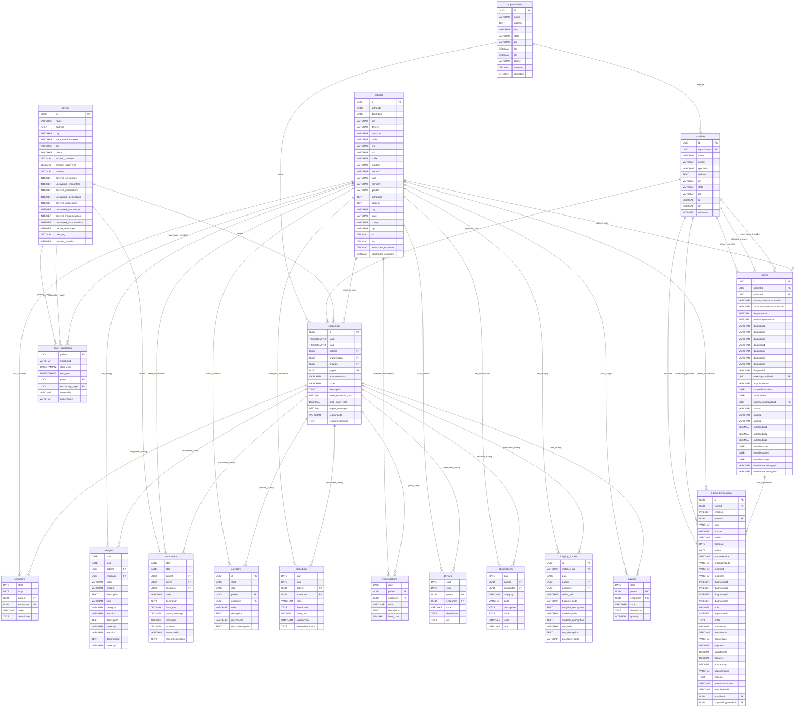

# Medical Summary Database Schema

## Entity Relationship Diagram

## Database Statistics

- **Total Tables**: 18
- **Total Records**: 1,835,567
- **Key Entities**:
  - 1,163 Patients
  - 1,127 Organizations
  - 5,056 Providers
  - 10 Payers
  - 61,459 Encounters

## Key Relationships

1. **Core Healthcare Entities**:
   - Organizations employ Providers
   - Patients receive care through Encounters
   - Payers cover healthcare costs

2. **Clinical Data**:
   - Encounters generate Conditions, Procedures, Medications
   - Patients have Allergies, Devices, Observations
   - Imaging Studies and Supplies are linked to specific encounters

3. **Financial Data**:
   - Claims track billing for patient care
   - Claims Transactions detail financial movements
   - Payer Transitions track insurance changes over time

## Indexes

The database includes performance indexes on:

- Patient names (last, first)
- Encounter patient references
- Encounter date ranges
- Condition, medication, observation, and procedure patient references
- Claims patient references
- Claims transaction claim references
